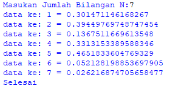
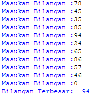
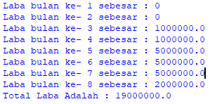

# labpy03 - Perulangan
# Iman Setiawan

**PDF Modul Praktikum 3 - Latihan 1**\
**Program Menampilkan Bilangan Acak**

Ini adalah code pyhton saya\
Menggunakan for in dan range

~~~
#Program Menampilkan Bilangan Acak

from random import random
n = int(input("Masukan Jumlah Bilangan N:"))

for i in range(n):
    a = random()%0.5
    print("data ke -",i + 1,"=", a)
print("Selesai")

~~~

Dan ini adalah hasil output dari Program di atas\

-----------------------------------------------------------------

**PDF Modul Praktikum 3 - Latihan 2**\
**Program Menampilkan Bilangan Terbesar dari Bilangan yang di Inputkan**

Ini adalah code pyhton saya\
Menggunakan while untuk perulangan tanpa batas dan break untuk keluar dari perulangan while tersebut.

~~~
#Program Menampilkan Bilangan Terbesar

angka = list()
while True:
    n = int(input("Masukan Bilangan :"))
    angka.append(n)
    if n == 0:
            break
print("Bilangan Terbesar:",max(angka) )
~~~

Dan ini adalah hasil output dari Program di atas\

-----------------------------------------------------------------

**PDF Modul Praktikum 3 - Tugas Praktikum 3**\
**Program Menghitung Laba**

Ini adalah code pyhton saya\
Code sederhana dengan perhitungan menjadi variabel, menggunakan data yang ada
~~~
#Program Menghitung Laba

#Input Data
modal = 100000000
b1 = 0
b2 = 0
b3 = 0.01
b4 = 0
b5 = 0.05
b6 = 0
b7 = 0
b8 = 0.02

#Proses Data
labab1 = modal * b1
labab2 = modal * b2
labab3 = modal * b3
labab4 = modal * b3
labab5 = modal * b5
labab6 = modal * b5
labab7 = modal * b5
labab8 = modal * b8
tlaba = labab1 + labab2 + labab3 + labab4 + labab5 + labab6 + labab7 + labab8 

#Output Data
print("Laba bulan ke- 1 sebesar :",labab1)
print("Laba bulan ke- 2 sebesar :",labab2)
print("Laba bulan ke- 3 sebesar :",labab3)
print("Laba bulan ke- 4 sebesar :",labab4)
print("Laba bulan ke- 5 sebesar :",labab5)
print("Laba bulan ke- 6 sebesar :",labab6)
print("Laba bulan ke- 7 sebesar :",labab7)
print("Laba bulan ke- 8 sebesar :",labab8)
print("Total Laba Adalah :", tlaba)
     
~~~

Dan ini adalah hasil output dari Program di atas\

-----------------------------------------------------------------

